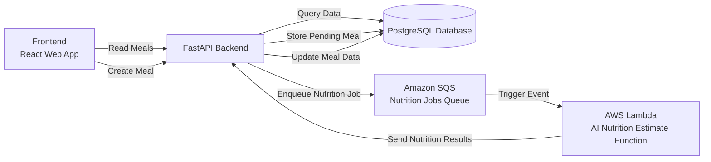

# Nutrition Tracker

A full-stack nutrition tracking application with Artificial Intelligence (AI)-powered meal analysis. Log meals by entering a text description and get automatic nutritional breakdowns powered by OpenAI.

## Features

- **AI-Powered Nutrition Estimation** - Enter a meal description (e.g., "chicken salad with ranch dressing") and get automatic nutritional values
- **Daily Nutrition Dashboard** - View aggregated calories, protein, carbs, fat, fiber, sugar, and sodium
- **Meal Logging** - Add meals with automatic timestamps and itemized nutrition breakdowns
- **Real-time Updates** - React Query handles caching and automatic refetching

## Tech Stack

### Frontend
- React 19 + TypeScript
- Vite
- TanStack React Query
- Axios

### Backend
- Python 3.12 + FastAPI
- SQLModel + SQLAlchemy
- PostgreSQL
- OpenAI GPT-4o-mini
- Alembic (migrations)
- Amazon SQS (Simple Queue Service) for asynchronous nutrition estimation jobs
- AWS Lambda for AI-based nutrition estimation
  
### Design

### Deployment

I am currently studying for the AWS Certified Solutions Architect – Associate (SAA-C03) certification.

I am using this project as a hands-on way to learn core Amazon Web Services (AWS) concepts and services, including backend APIs, asynchronous processing, and cloud deployment patterns.

I am following Adrian Cantrill’s online course as part of that learning journey:

AWS Certified Solutions Architect – Associate (SAA-C03)

